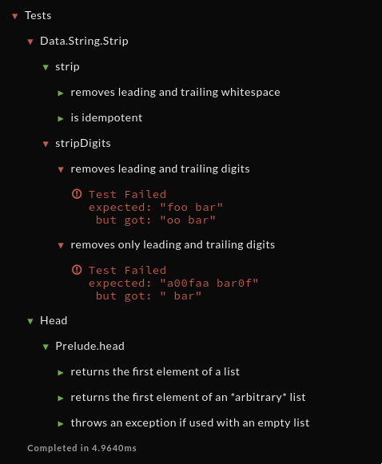

# Test.Hspec.Formatters.Qualified

A prototype of Hspec formatter for [Qualified.io](https://www.qualified.io/) and [Codewars](https://www.codewars.com).

To be used with [LTS Haskell 10.3](https://www.stackage.org/lts-10.3):
- GHC 8.2.2
- Hspec 2.4.4

---



```
stack runghc -- -ilibrary:src:test test/Main.hs
```

```

<DESCRIBE::>Tests

<DESCRIBE::>Data.String.Strip

<DESCRIBE::>strip

<IT::>removes leading and trailing whitespace

<PASSED::>Test Passed

<COMPLETEDIN::>

<IT::>is idempotent

<PASSED::>Test Passed

<COMPLETEDIN::>

<COMPLETEDIN::>

<DESCRIBE::>stripDigits

<IT::>removes leading and trailing digits


<FAILED::>Test Failed<:LF:>expected: "foo bar"<:LF:> but got: "oo bar"

<COMPLETEDIN::>

<IT::>removes only leading and trailing digits


<FAILED::>Test Failed<:LF:>expected: "a00faa bar0f"<:LF:> but got: " bar"

<COMPLETEDIN::>

<COMPLETEDIN::>

<COMPLETEDIN::>

<DESCRIBE::>Head

<DESCRIBE::>Prelude.head

<IT::>returns the first element of a list

<PASSED::>Test Passed

<COMPLETEDIN::>

<IT::>returns the first element of an *arbitrary* list

<PASSED::>Test Passed

<COMPLETEDIN::>

<IT::>throws an exception if used with an empty list

<PASSED::>Test Passed

<COMPLETEDIN::>

<COMPLETEDIN::>

<COMPLETEDIN::>

<COMPLETEDIN::>4.9640
```
